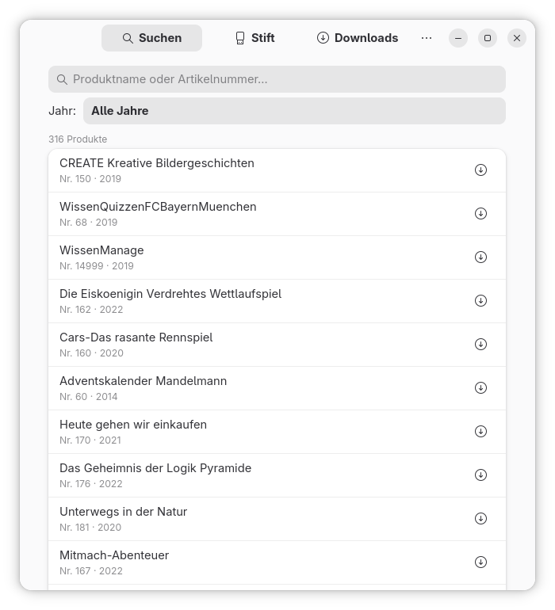

# TipToi Manager

> Nativer GNOME-Manager für TipToi®-Stifte unter Linux

**Stack:** Python 3.11 · GTK 4 · libadwaita  
**Plattform:** Linux (primär Fedora / GNOME)



---

## Motivation

Der offizielle Ravensburger TipToi® Manager ist nur für Windows und macOS verfügbar.
**TipToi Manager** schließt diese Lücke mit einer nativen GNOME-Anwendung, die sich
nahtlos in den Desktop integriert und ohne Terminal-Kenntnisse bedienbar ist.

---

## Funktionsumfang

| Funktion | Status |
|---|:---:|
| Produktliste von Ravensburger laden & cachen | ✅ |
| Suche nach Name oder Artikelnummer | ✅ |
| Filter nach Erscheinungsjahr | ✅ |
| GME-Datei herunterladen (mit Fortschrittsbalken) | ✅ |
| Mehrere Downloads parallel (je mit Abbrechen-Button) | ✅ |
| Dateigröße vor dem Download anzeigen | ✅ |
| Direkt auf Stift herunterladen (1-Klick) | ✅ |
| TipToi-Stift automatisch erkennen (GIO VolumeMonitor) | ✅ |
| Stift-Label anzeigen (Name + Pfad in Klammern) | ✅ |
| Installierte Produkte auf dem Stift anzeigen | ✅ |
| Produkt vom Stift löschen (mit Bestätigungsdialog) | ✅ |
| Datei aus Download-Ordner auf Stift kopieren | ✅ |
| Status in Suchergebnissen (lokal / auf Stift vorhanden) | ✅ |
| Duplikat-Warnung im Download-Ordner | ✅ |
| Einstellungen (Download-Ordner, Cache-Dauer, CSV-URL) | ✅ |
| Internationalisierung (gettext, Englisch verfügbar) | ✅ |
| About-Dialog | ✅ |

---

## Installation

### Flatpak (empfohlen)

> Flathub-Einreichung in Vorbereitung.

Zum lokalen Testen per `flatpak-builder`:

```bash
git clone https://github.com/tiptoi-linux/tiptoi-manager
cd tiptoi-manager
flatpak install flathub org.gnome.Platform//48 org.gnome.Sdk//48
flatpak-builder --user --install --force-clean build-dir \
  packaging/io.github.tiptoi_linux.TiptoiManager.yaml
flatpak run io.github.tiptoi_linux.TiptoiManager
```

### Entwicklungsmodus (ohne Installation)

```bash
# Fedora
sudo dnf install python3-gobject gtk4 libadwaita

# Ubuntu / Debian
sudo apt install python3-gi gir1.2-gtk-4.0 gir1.2-adw-1

git clone https://github.com/tiptoi-linux/tiptoi-manager
cd tiptoi-manager
python -m tiptoi_gtk.main
```

### Per pip

```bash
pip install -e . --user
tiptoi-gtk
```

---

## Projektstruktur

```
tiptoi-manager/
├── tiptoi_gtk/
│   ├── main.py                  # Einstiegspunkt
│   ├── application.py           # Adw.Application (App-ID, activate)
│   ├── window.py                # Hauptfenster: Rahmen + gemeinsame Hilfsmethoden
│   ├── views/
│   │   ├── search_view.py       # Tab „Suchen": Suchfeld, Jahresfilter, Produktliste
│   │   ├── pen_view.py          # Tab „Stift": Erkennung, Infos, Dateiverwaltung
│   │   ├── downloads_view.py    # Tab „Downloads": lokale GME-Dateien
│   │   └── download_manager.py  # Aktive Downloads, Fortschritt, Abbrechen
│   ├── dialogs/
│   │   └── preferences.py       # Einstellungsfenster
│   ├── backend/
│   │   ├── catalog.py           # CSV laden, cachen, suchen, Jahresfilter
│   │   ├── downloader.py        # HTTP-Download (threaded, Abbruch, Größe)
│   │   ├── gme.py               # GME-Dateioperationen (kopieren, löschen)
│   │   ├── pen.py               # Stifterkennung via GIO VolumeMonitor
│   │   └── settings_manager.py  # JSON-Einstellungen ($XDG_CONFIG_HOME/tiptoi-gtk/)
│   ├── model/
│   │   └── product.py           # Produkt-Datenklasse
│   └── locale/
│       └── en/LC_MESSAGES/      # Englische Übersetzung (.po + .mo)
├── data/
│   ├── io.github.tiptoi_linux.TiptoiManager.desktop
│   ├── io.github.tiptoi_linux.TiptoiManager.metainfo.xml
│   ├── icons/hicolor/           # App-Icon in 48 · 64 · 128 · 256 · 512 px
│   └── screenshots/
├── packaging/
│   └── io.github.tiptoi_linux.TiptoiManager.yaml  # Flatpak-Manifest
├── tests/
├── pyproject.toml
└── README.md
```

---

## Architektur

### Views als Mixin-Klassen

Die drei Tabs und der Einstellungsdialog sind in separate Dateien ausgelagert.
`TiptoiWindow` erbt von allen Mixins — der geteilte Zustand (`_pen_path`,
`_products` usw.) liegt auf der Window-Instanz und ist ohne Übergabe erreichbar.

```
TiptoiWindow
  ├── SearchViewMixin      (views/search_view.py)
  ├── PenViewMixin         (views/pen_view.py)
  ├── DownloadsViewMixin   (views/downloads_view.py)
  ├── DownloadManagerMixin (views/download_manager.py)
  ├── PreferencesDialogMixin (dialogs/preferences.py)
  └── Adw.ApplicationWindow
```

### Asynchrones Download-Modell

Alle Netzwerk- und I/O-Operationen laufen in Daemon-Threads. UI-Updates werden
ausschließlich über `GLib.idle_add()` im GTK-Hauptthread durchgeführt:

```
[GTK-Hauptthread]              [Hintergrundthread]
        │                               │
        │── download_gme() ───────────▶ │  urllib.urlopen(...)
        │   returns Event               │  size_cb(12_450_000)  → size label
        │◀── GLib.idle_add() ──────────│  progress_cb(0.42)    → progress bar
        │                               │
        │   cancel_event.set() ───────▶ │  cancel_event.is_set() → bricht ab
        │◀── GLib.idle_add() ──────────│  done_cb(False, CANCEL_SENTINEL)
```

### Datenspeicherung

Alle Pfade folgen den XDG-Standards und funktionieren korrekt im Flatpak-Sandbox:

| Pfad | Inhalt |
|---|---|
| `$XDG_CACHE_HOME/tiptoi-gtk/produkte.csv` | Ravensburger Produktliste |
| `$XDG_CONFIG_HOME/tiptoi-gtk/settings.json` | Einstellungen |
| `$XDG_DOWNLOAD_DIR/tiptoi/` | Heruntergeladene GME-Dateien (Standard) |

### Stifterkennung

1. **GIO VolumeMonitor** – reagiert auf `mount-added` / `mount-removed`
2. **Scan beim Start** – prüft bereits gemountete Volumes via `scan_existing_mounts()`

Ein Mount gilt als TipToi-Stift, wenn im Root-Verzeichnis `.gme`-, `.key`-Dateien
oder ein `system/`-Ordner vorhanden sind.

### Internationalisierung

Die App nutzt Python `gettext`. Deutsche Strings sind die Quellsprache.
Eine englische Übersetzung liegt kompiliert unter
`tiptoi_gtk/locale/en/LC_MESSAGES/tiptoi-gtk.mo` bereit.

Neue Übersetzung hinzufügen:

```bash
mkdir -p tiptoi_gtk/locale/fr/LC_MESSAGES
cp tiptoi_gtk/locale/en/LC_MESSAGES/tiptoi-gtk.po tiptoi_gtk/locale/fr/LC_MESSAGES/
# ... übersetzen ...
msgfmt -o tiptoi_gtk/locale/fr/LC_MESSAGES/tiptoi-gtk.mo \
           tiptoi_gtk/locale/fr/LC_MESSAGES/tiptoi-gtk.po
```

---

## Referenzen

- [GNOME Human Interface Guidelines](https://developer.gnome.org/hig/)
- [libadwaita Dokumentation](https://gnome.pages.gitlab.gnome.org/libadwaita/doc/)
- [PyGObject Dokumentation](https://pygobject.gnome.org/)
- [tip-toi-reveng (tttool)](https://github.com/entropia/tip-toi-reveng)
